## 💭 Reflexión y Conclusiones del Proyecto

### 🎓 Aprendizajes Principales

Este proyecto permitió implementar conceptos empresariales reales en una API REST:

1. **Arquitectura Modular MVC** - Separación clara de responsabilidades hace el código mantenible y escalable
2. **Seguridad en Capas** - Autenticación + Autorización + Validación + Sanitización = protección integral
3. **Soft Delete** - Concepto crítico en sistemas reales donde NO se puede perder datos
4. **Logging Profundo** - Auditoría completa facilita debugging y cumplimiento normativo
5. **Control de Roles** - Admin vs User no es cosmético, es seguridad real

### 🚀 Desafíos Enfrentados

| Desafío | Solución |
|---------|----------|
| Inyección SQL | Prepared statements con PDO - SIEMPRE |
| Validación insuficiente | Regex Unicode para nombres acentuados + sanitización |
| Sin control de acceso | Middleware de roles en cada ruta sensible |
| Datos perdidos al eliminar | Soft delete con timestamp - recuperación garantizada |
| Logs no controlados | Rotación automática con gzip - gestión de almacenamiento |
| XSS potencial | HTML encoding en todas las entradas y salidas |

### ❓ ¿Por Qué Soft Delete?

**Ventajas Implementadas:**

✅ **Recuperación Accidental** - El admin puede restaurar datos borrados por error  
✅ **Auditoría Completa** - Campo `deleted_at` registra QUIÉN, CUÁNDO se eliminó  
✅ **Cumplimiento Legal** - Muchas leyes requieren historial de cambios  
✅ **Integridad Referencial** - Las relaciones en BD no se rompen  
✅ **Reversibilidad** - Cambio lógico, no físico - fácil de deshacer  


### 📝 Conclusión Final

APISelene es una demostración práctica de que la seguridad y la arquitectura NO son opcional en desarrollo web profesional. Cada decisión (prepared statements, soft delete, logging) tiene justificación empresarial real, no es "por si acaso".

El proyecto muestra que un estudiante puede implementar características de nivel profesional siguiendo principios SOLID, patrones de diseño y estándares de seguridad reconocidos internacionalmente.

**Resultado:** API REST lista para producción con autenticación, autorización, auditoría y recuperación de datos - exactamente lo que necesita una aplicación académica real.# 📚 APISelene - API REST de Gestión Académica

## 🎯 Objetivo General

Desarrollar una API REST completa y modular para la gestión de alumnos, conectada a base de datos MySQL, con sistema robusto de autenticación, control de roles basado en sesiones activas, y operaciones CRUD seguras que incluyen soft delete para preservar la integridad de datos.


---

## 🚀 Instalación y Configuración

### Pasos de Instalación

#### 1. Clonar el Repositorio

```bash
# Clonar en el directorio de XAMPP
cd C:\xampp\htdocs
git clone https://github.com/Seleneb25/APISelene.git
cd APISelene
```

#### 2. Crear la Base de Datos

Ejecutar el siguiente script en phpMyAdmin o consola MySQL:

```sql
-- Crear base de datos
CREATE DATABASE rest_api_selene CHARACTER SET utf8mb4 COLLATE utf8mb4_unicode_ci;
USE rest_api_selene;

-- Tabla de usuarios para autenticación
CREATE TABLE usuarios_auth (
    id INT AUTO_INCREMENT PRIMARY KEY,
    username VARCHAR(50) UNIQUE NOT NULL,
    email VARCHAR(100) UNIQUE NOT NULL,
    password_hash VARCHAR(255) NOT NULL,
    rol ENUM('admin', 'user') DEFAULT 'user',
    activo TINYINT(1) DEFAULT 1,
    created_at TIMESTAMP DEFAULT CURRENT_TIMESTAMP
);

-- Tabla de alumnos con soft delete
CREATE TABLE alumnos (
    id INT AUTO_INCREMENT PRIMARY KEY,
    nombre VARCHAR(100) NOT NULL,
    edad INT,
    correo VARCHAR(100),
    rol VARCHAR(50) DEFAULT 'Alumno',
    activo TINYINT(1) DEFAULT 1,
    deleted_at TIMESTAMP NULL,
    created_at TIMESTAMP DEFAULT CURRENT_TIMESTAMP,
    updated_at TIMESTAMP DEFAULT CURRENT_TIMESTAMP ON UPDATE CURRENT_TIMESTAMP
);

-- Insertar usuarios por defecto
INSERT INTO usuarios_auth (username, email, password_hash, rol) VALUES 
('admin', 'admin@apiselene.com', '$2y$10$92IXUNpkjO0rOQ5byMi.Ye4oKoEa3Ro9llC/.og/at2.uheWG/igi', 'admin'),
('selene', 'selene@apiselene.com', '$2y$10$92IXUNpkjO0rOQ5byMi.Ye4oKoEa3Ro9llC/.og/at2.uheWG/igi', 'user');
```

**Credenciales de Prueba:**
- Usuario Admin: `admin` / `password`
- Usuario Regular: `selene` / `password`

#### 3. Verificar Configuración

- Acceder a `http://localhost/APISelene/` en el navegador

---

## 🔐 Sistema de Autenticación y Seguridad

### Autenticación por Sesiones

La API utiliza sesiones PHP seguras. Al hacer login, se almacenan datos en `$_SESSION`:

```php
$_SESSION['user_id'] = $user['id'];
$_SESSION['username'] = $user['username'];
$_SESSION['rol'] = $user['rol'];
$_SESSION['logged_in'] = true;
```

### Control de Roles

| Rol | Permisos |
|-----|----------|
| **👑 Administrador** | Acceso completo (GET, POST, PATCH, DELETE) |
| **👤 Usuario/Estudiante** | Solo lectura (GET) |

### Flujo de Autenticación

1. Usuario ingresa credenciales en `login.html`
2. Se envía POST a `/api/auth/login`
3. Se valida contra `usuarios_auth`
4. Si es válido, se inicia sesión y se redirige a `dashboard.html`
5. Cada petición a la API pasa por `AuthMiddleware` que verifica `$_SESSION['logged_in']`

### Protección contra Vulnerabilidades

#### 1. Inyección SQL
- Uso exclusivo de **prepared statements** con PDO
- Sanitización de todas las entradas

```php
$stmt = $this->db->prepare("SELECT * FROM alumnos WHERE id = :id");
$stmt->execute([':id' => $id]);
```

#### 2. Validación Server-Side
- Validación de tipos y formatos con expresiones regulares
- Rechazo de datos inválidos antes de procesamiento

```php
if (!preg_match('/^[\p{L}\s]+$/u', $nombre)) {
    return ["valid" => false, "error" => "Nombre inválido"];
}
```

#### 3. Sanitización
- HTML encoding para prevenir XSS
- Limpieza de caracteres especiales
- Normalización de datos

---

## 📊 Operaciones CRUD con Soft Delete

### Endpoints Disponibles

| Método | Ruta | Descripción | Roles Permitidos |
|--------|------|-------------|-----------------|
| `POST` | `/api/auth/login` | Iniciar sesión | Público |
| `POST` | `/api/auth/logout` | Cerrar sesión | Autenticado |
| `GET` | `/api/auth/check` | Verificar autenticación | Público |
| `GET` | `/api/alumnos` | Listar alumnos activos | 👑👤 |
| `POST` | `/api/alumnos` | Crear alumno | 👑 |
| `PATCH` | `/api/alumnos` | Actualizar alumno | 👑 |
| `DELETE` | `/api/alumnos` | Soft delete alumno | 👑 |
| `GET` | `/api/alumnos/deleted` | Ver alumnos eliminados | 👑 |
| `POST` | `/api/alumnos/restore` | Restaurar alumno | 👑 |
| `DELETE` | `/api/alumnos/force-delete` | Eliminar permanentemente | 👑 |
| `GET` | `/api/stats` | Estadísticas del sistema | 👑👤 |

### Implementación de Soft Delete

El **soft delete** marca registros como eliminados sin borrarlos físicamente:

```php
// Soft delete: marca como inactivo
UPDATE alumnos SET activo = 0, deleted_at = CURRENT_TIMESTAMP WHERE id = 1;

// Restaurar: reactiva el registro
UPDATE alumnos SET activo = 1, deleted_at = NULL WHERE id = 1;

// Hard delete: eliminación permanente
DELETE FROM alumnos WHERE id = 1;
```

**Ventajas:**
- ✅ Recuperación de datos accidental
- ✅ Auditoría y cumplimiento normativo
- ✅ Integridad referencial preservada
- ✅ Historial de cambios disponible

---

## 🛡️ Validación y Sanitización

### Validadores Implementados

```php
Validator::validateNombre($nombre)        // Solo letras y espacios
Validator::validateEmail($email)          // Formato email válido
Validator::validateEdad($edad)            // Número entre 1-120
Validator::validateId($id)                // Número positivo
Validator::validateAlumnoData($data)      // Validación completa
```

### Sanitizadores Implementados

```php
Sanitizer::sanitizeString($input)         // HTML encode y trim
Sanitizer::sanitizeEmail($email)          // Formato email limpio
Sanitizer::sanitizeInt($input)            // Número entero
Sanitizer::sanitizeAlumnoData($data)      // Sanitización por reglas
```

---

## 📝 Logs de Actividad y Errores

### Sistema de Logging Avanzado

El logger implementado en `config/logger.php` incluye:

**Niveles de Log:**
- `DEBUG` - Información detallada para desarrollo
- `INFO` - Eventos normales del sistema
- `WARN` - Advertencias y situaciones inusuales
- `ERROR` - Errores recuperables
- `FATAL` - Errores críticos

**Registro de Eventos Especializados:**

```php
Logger::info("Log informativo");
Logger::warn("Advertencia");
Logger::error("Error recuperable");
Logger::audit("Usuario logueado", $username, "login");
Logger::security("Intento de acceso no autorizado", ["ip" => $ip]);
Logger::database("Consulta ejecutada", ["query" => $sql]);
Logger::api("Petición API", ["endpoint" => "/alumnos"]);
```

**Características:**
- 📂 Rotación automática de logs (comprime a gzip cada 5000 líneas)
- 📊 Archivo principal: `logs/server.log`
- 🗂️ Archivos archivados: `logs/archive/`
- 🔍 Información completa: timestamp, IP, método HTTP, contexto

**Ejemplo de Log:**
```
[2024-01-15 14:32:45] [INFO] [IP:127.0.0.1] [POST /api/alumnos] [AUDIT] Usuario logueado | Context: {"user":"admin","action":"login"}
[2024-01-15 14:33:12] [INFO] [IP:127.0.0.1] [POST /api/alumnos] Alumno insertado correctamente con ID: 5
[2024-01-15 14:35:20] [WARN] [IP:127.0.0.1] [DELETE /api/alumnos] [SECURITY] Intento de acceso no autorizado | Context: {"ip":"127.0.0.1"}
```

---

## 🎯 Demostración del Funcionamiento

### Flujo Completo CRUD

#### 1️⃣ Login
```bash
POST /api/auth/login
{
    "username": "admin",
    "password": "password"
}

RESPUESTA:
{
    "success": true,
    "message": "Login exitoso",
    "user": {
        "id": 1,
        "username": "admin",
        "email": "admin@apiselene.com",
        "rol": "admin"
    }
}
```

#### 2️⃣ Crear Alumno (Solo Admin)
```bash
POST /api/alumnos
{
    "nombre": "Juan Pérez",
    "edad": 20,
    "correo": "juan@ejemplo.com",
    "rol": "Alumno"
}

RESPUESTA:
{
    "success": true,
    "id": 5
}
```

#### 3️⃣ Listar Alumnos (Todos Autenticados)
```bash
GET /api/alumnos

RESPUESTA:
[
    {
        "id": 5,
        "nombre": "Juan Pérez",
        "edad": 20,
        "correo": "juan@ejemplo.com",
        "rol": "Alumno",
        "created_at": "2024-01-15 14:32:45"
    }
]
```

#### 4️⃣ Actualizar Alumno (Solo Admin)
```bash
PATCH /api/alumnos
{
    "id": 5,
    "edad": 21
}

RESPUESTA:
{
    "success": true,
    "affected_rows": 1
}
```

#### 5️⃣ Soft Delete - Alumno
```bash
DELETE /api/alumnos
{
    "id": 5
}

RESPUESTA:
{
    "success": true,
    "message": "Alumno eliminado correctamente (soft delete)"
}
```

#### 6️⃣ Ver Alumnos Eliminados (Solo Admin)
```bash
GET /api/alumnos/deleted

RESPUESTA:
[
    {
        "id": 5,
        "nombre": "Juan Pérez",
        "edad": 21,
        "correo": "juan@ejemplo.com",
        "rol": "Alumno",
        "deleted_at": "2024-01-15 14:35:20"
    }
]
```

#### 7️⃣ Restaurar Alumno (Solo Admin)
```bash
POST /api/alumnos/restore
{
    "id": 5
}

RESPUESTA:
{
    "success": true,
    "message": "Alumno restaurado correctamente"
}
```

#### 8️⃣ Logout
```bash
POST /api/auth/logout

RESPUESTA:
{
    "success": true,
    "message": "Logout exitoso"
}
```

---

## 📸 Capturas del Funcionamiento (Guía Paso a Paso)


---

### **1️⃣ Captura: Base de Datos - Tabla `alumnos`**

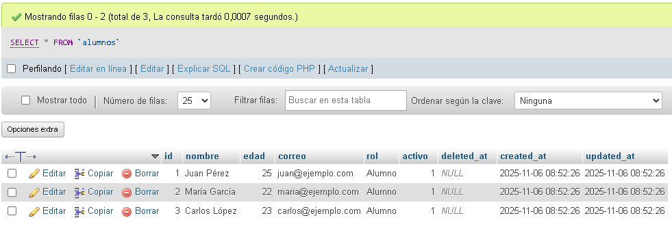

**Por qué capturar:** Muestra la implementación del soft delete con campos `activo` y `deleted_at`

---

### **2️⃣ Captura: Base de Datos - Tabla `usuarios_auth`**

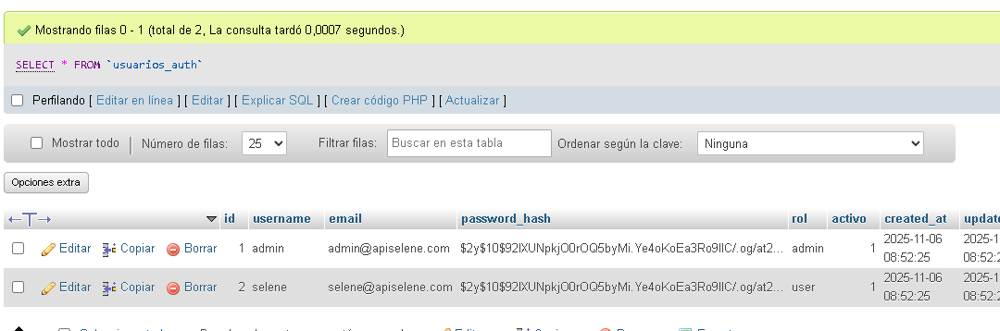

**Por qué capturar:** Evidencia la estructura de autenticación y control de roles

---

### **3️⃣ Captura: Interfaz de Login**

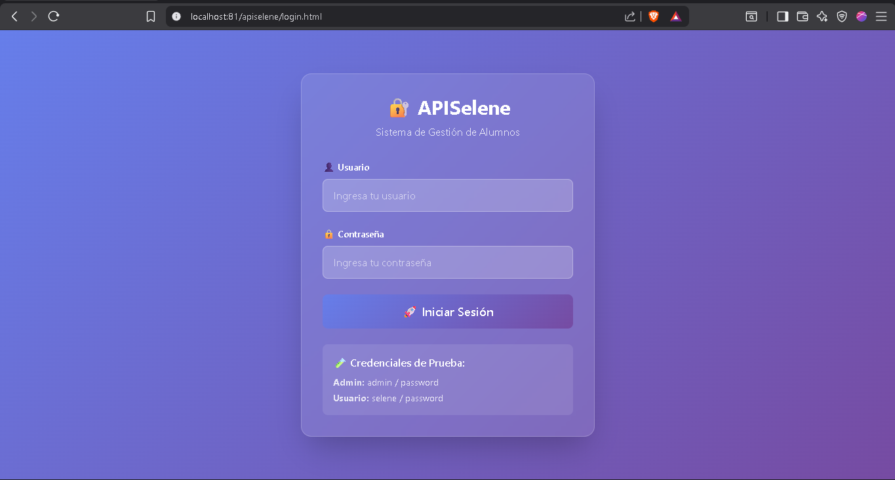


**Por qué capturar:** Muestra la interfaz responsiva y las credenciales de prueba

---

### **4️⃣ Captura: Dashboard - Usuario Normal (Acceso Limitado)**

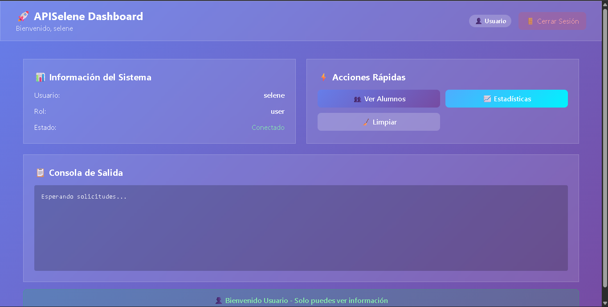

**Por qué capturar:** Evidencia el control de roles - usuario normal sin acceso a operaciones de escritura

---

### **5️⃣ Captura: Dashboard - Admin (Acceso Completo)**

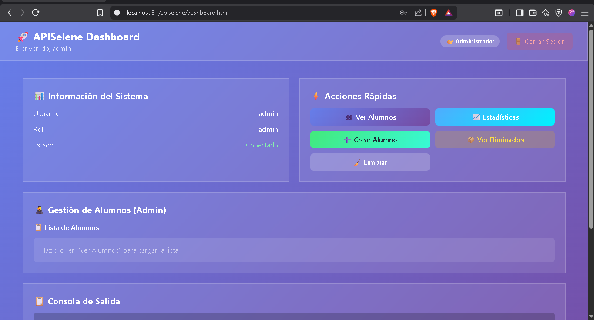

**Por qué capturar:** Muestra acceso admin completo vs usuario regular

---

### **6️⃣ Captura: Admin - Formulario de Crear Alumno**

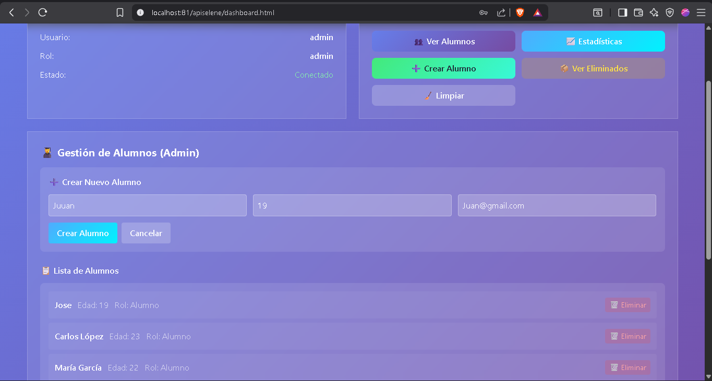

**Por qué capturar:** Evidencia la funcionalidad de CREATE (POST)

---

### **7️⃣ Captura: Admin - Lista de Alumnos**

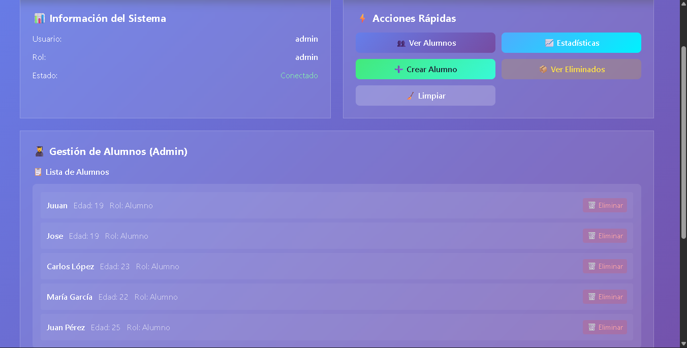

**Por qué capturar:** Muestra la funcionalidad de READ (GET) y la tabla de alumnos

---

### **8️⃣ Captura: Admin - Confirmación de Soft Delete**

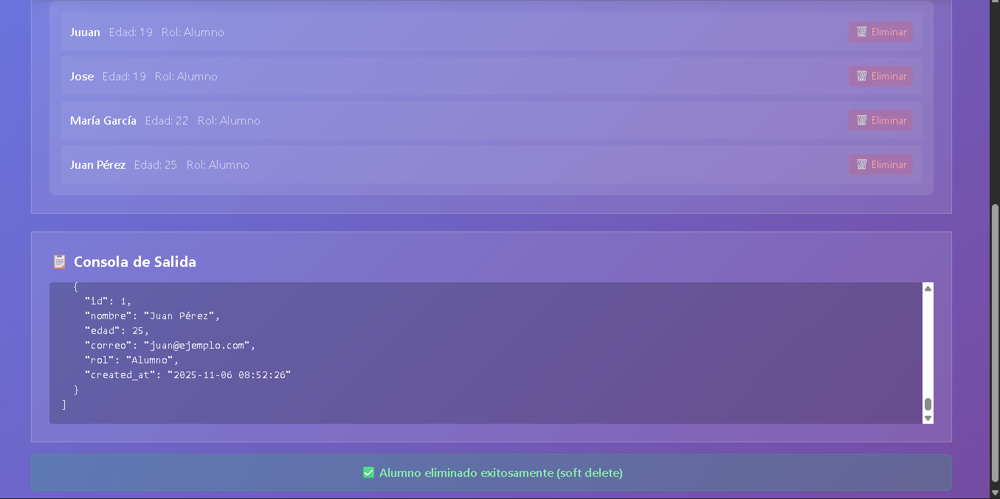

**Por qué capturar:** Muestra la confirmación de acción destructiva (seguridad)

---

### **9️⃣ Captura: Admin - Papelera (Alumnos Eliminados)**

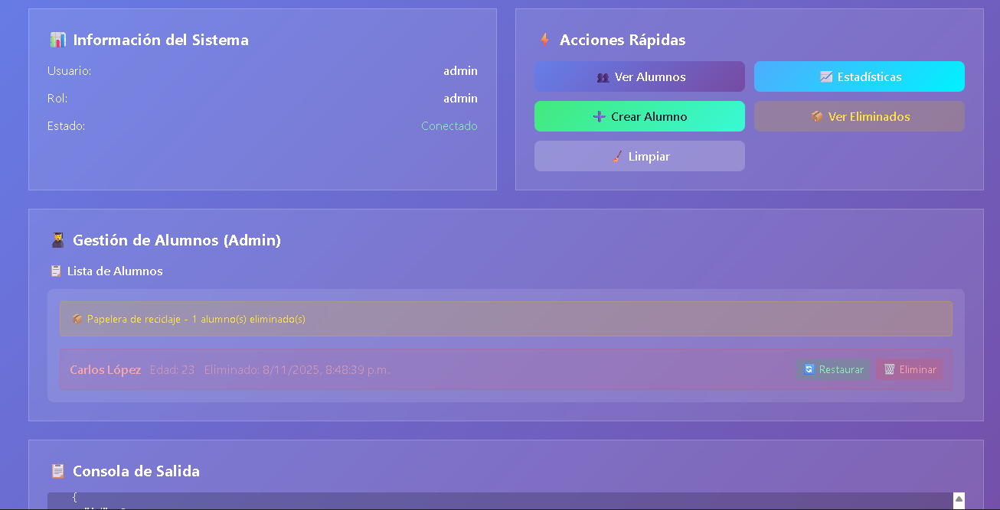

**Por qué capturar:** Evidencia el soft delete y la papelera funcionando

---

### **🔟 Captura: Admin - Restaurar Alumno desde Papelera**

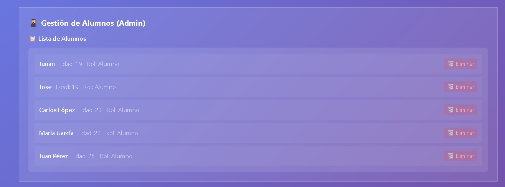

**Por qué capturar:** Muestra la funcionalidad de restauración (UPDATE soft delete)

---


### **11 Bonus: Captura - Logs en el Servidor (`logs/server.log`)**

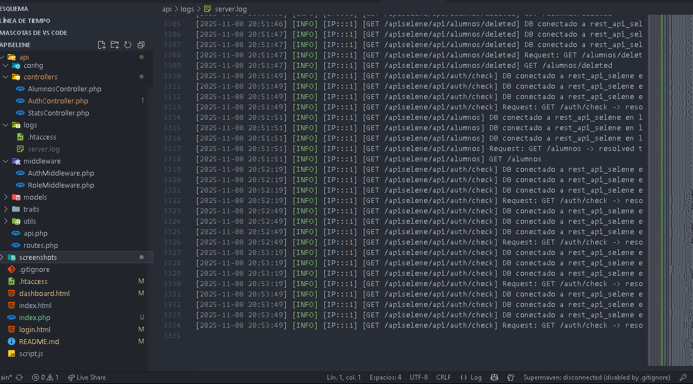

**Por qué capturar:** Muestra el sistema de logging funcionando en backend

---


## 🔗 Enlaces Importantes

**Repositorio GitHub:** https://github.com/Seleneb25/APISelene.git

**Acceso Local:** `http://localhost/APISelene/`

**Credenciales de Prueba:**
- Admin: `admin` / `password`
- Usuario: `selene` / `password`

---

## ✨ Notas Finales

Este proyecto implementa una API REST profesional con arquitectura modular, seguridad robusta y características empresariales como soft delete y logging completo. La separación clara entre roles garantiza que los usuarios regulares solo accedan a operaciones permitidas, mientras que los administradores tienen control total del sistema.

El soft delete preserva la integridad de datos, permitiendo recuperación accidental y auditoría completa de cambios. El sistema de logging detallado facilita debugging y cumplimiento normativo.s